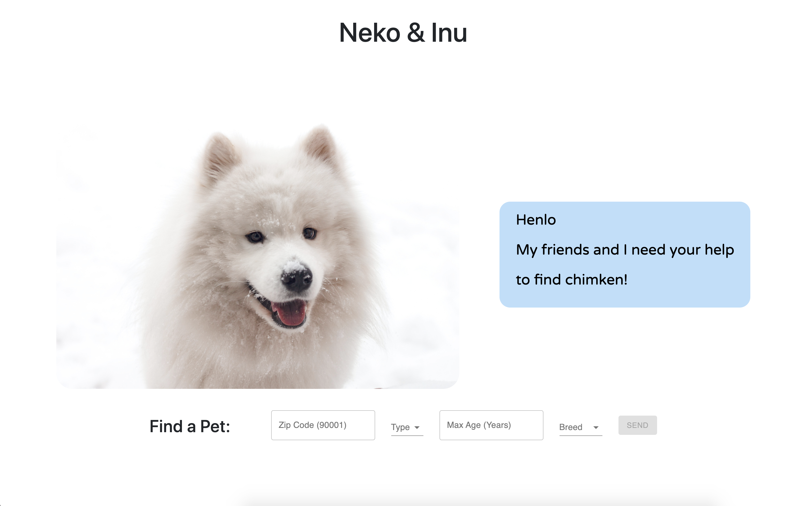

# Neko & Inu
Means Cat🐱 and Dog🐶 in Japanese 
     

**Front-End**
- Webpack
- Babel 
- React
- React Router
- Context API for global state management 

**Back-End**
- Node
- Express 


## App Setup 
1. Open your terminal or command line and type: `git clone https://github.com/tobyau/Neko-Inu.git`
2. go into your project directory `cd Neko-Inu`
3. Get an API key from [https://getyourpet.com/api-documentation/](https://getyourpet.com/api-documentation/)
4. Create a `dev.js` file in the config directory
4. Save that key in following format
```
module.exports = {
  apiKey: "your-api-key",
}
```
5. Install dependencies by typing `npm install && cd client && npm install` 


## Running the application
Open a terminal and type the following 
```
npm run dev 
```

Check out the app on http://localhost:8080/ 

